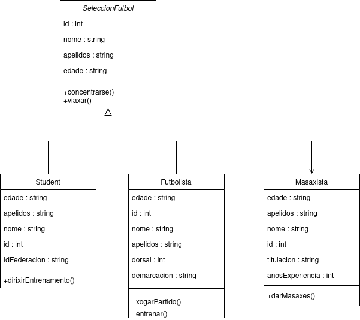

# Tarea Repaso

Este README documenta el proceso realizado para un boletín de Java llamado "SeleccionFutbol". A continuación, se detallan las acciones realizadas:
1. Diagrama de Flujo

Diagrama de Flujo
2. Diagrama de Clases




Diagrama de Clases

3. Generar el JAR

Para generar el archivo JAR ejecutable:
```
javac *.java
jar cfe SeleccionFutbol.jar Main *.class
```

4. Etiquetar el Commit
'''
git tag -a v1.0 -m "Versión 1.0 con JAR"
git push origin v1.0
'''

5. Crear Release v1.0 en GitHub

    Ir a la sección "Releases" en GitHub.
    Hacer clic en "Draft a new release".
    Asignar un nombre a la release (v1.0), agregar notas adicionales si es necesario y adjuntar el archivo JAR.

6. Modificar el Boletín y Generar Otro JAR

Las modificaciones han sido eliminar la clase "Entrenador" y cambiar la clase "Futbolista" por "Porteiro" con cambios en 2 de sus atributos. Una vez hecho esto, se vuelven a ejecutar los comandos hechos en el apartado 3 para generar el archivo.

7. Etiquetar la Modificación
'''
git tag -a v2.0 -m "Versión 2.0 con modificaciones"
git push origin v2.0
'''
8. Crear Release v2.0 en GitHub

    Ir a la sección "Releases" en GitHub.
    Hacer clic en "Draft a new release".
    Asignar un nombre a la release (v2.0), agregar notas adicionales si es necesario y adjuntar el nuevo archivo JAR.
